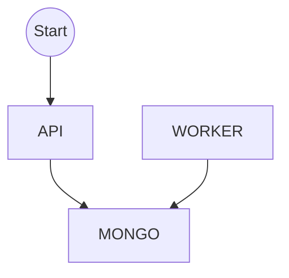

Clojure DKS
===========

Docker Service

# Architecture



The application has three components:

## API 
- IN/OUT data over HTTP
- Restiful architecture, all verbs (GET, POST, PUT, PATCH, DELETE)
- Database load and restore
- Validation of data traffic
- Write on DB the scheduled jobs
- Business rules (Create, Restore, Update and Delete Schedule)

## Mongo DB
- Keep stateful data (CRUD)
- Glue between API and Worker

## WORKER
- Searching for jobs and run all then (Every 10 seconds)
- Update output (stdout, stderr, exit_code) of the jobs to database

# whys?

- Language: Clojure
    - Just need to learn a new language
    - I never used this language before and I just accept the challenge
    - I never used Functional Languages before
- Worker and API:
    - Separating it is possíble to scale better horizontally (I have to improve update before, but is easy)
    - The load of both is very different
    - The solution is based on docker, I can put one worker in N machines to do the "jobs" without API overhead (API after up consommes ~450M and the worker just ~70M)
    - If the API is down for N reasons the jobs will run

## The main components (Libs)

- metosin/compojure-api
- com.novemberain/monger
- clj-time

> Special thanks for everyone

# How to run

[API DOC](api/README.md)

[WORKER DOC](worker/README.md)

- requirements
    - docker >= 17.05 [Multi Stage Build](https://docs.docker.com/develop/develop-images/multistage-build/)
    - docker-compose
    - it consumes ~1G RAM

- build the project

`docker-compose build`

- run the project

`docker-compose up -d`

> the runner mounts the /tmp/ajb and put temporally files there. Is not possible to run this project in docker dind

## Run others items of project (local)

```
# root of project
# api itens

cd api
lein test        # test only
lein cloverage   # test and coverage
lein eastwood    # linter a lot of bugs on compojure
lein kibit       # sast
lein codox       # generate static docs

cd ../worker

cd api
lein test        # test only
lein cloverage   # test and coverage
lein eastwood    # linter a lot of bugs on compojure
lein kibit       # sast
lein codox       # generate static docs

```

> for tests work, needs a mongo db listening and working

Check the api and worker docs

# TODO

1. I can't finished the validation of endpoints (exists, but is too simple) Schema.core is very different.
2. I don't test it with N workers (possibles side effects, run the same jobs twice or N times).
3. In schedule time I wanted to use linux cron schema (re-run jobs and others), but the item 1. responds it.
4. The health check isn't a very checkable.
